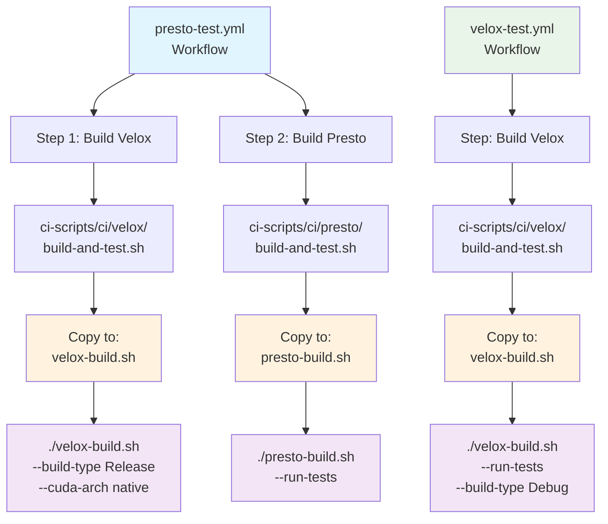

# CI Scripts and Workflows

This directory contains CI scripts and documentation for building and testing Velox and Presto.

## Directory Structure

```
ci/
├── README.md              # This file - CI overview and workflow documentation
├── velox/
│   ├── README.md          # Velox-specific CI documentation
│   └── build-and-test.sh  # Velox build and test script
└── presto/
    ├── README.md          # Presto-specific CI documentation
    └── build-and-test.sh  # Presto build and test script
```

## Available Workflows

### 1. `velox-test.yml`
- **Purpose**: Build and test Velox with cuDF support
- **Trigger**: Manual dispatch with configurable inputs
- **Script Used**: `ci/velox/build-and-test.sh` (copied as `velox-build.sh`)

### 2. `presto-test.yml`  
- **Purpose**: Build Velox + Presto integration testing
- **Trigger**: Manual dispatch with configurable inputs
- **Scripts Used**: 
  - `ci/velox/build-and-test.sh` (copied as `velox-build.sh`)
  - `ci/presto/build-and-test.sh` (copied as `presto-build.sh`)

### 3. `say-hello.yml`
- **Purpose**: Simple workflow for testing GitHub Actions setup
- **Trigger**: Manual dispatch or push/PR to main

## Workflow Architecture



## Key Design Decisions

### Script Naming Strategy
To avoid filename collisions when multiple scripts are used in the same workflow, each script is copied with a unique, descriptive name:

- **Velox builds**: Always use `velox-build.sh`
- **Presto builds**: Always use `presto-build.sh`

This ensures that in the `presto-test.yml` workflow, both scripts can coexist without overwriting each other.

### Configurable Build Options

All scripts support configurable options that can be passed through GitHub Actions workflow inputs:

#### Velox Build Options
- `--run-tests`: Enable test execution
- `--build-type`: CMake build type (Release/Debug/RelWithDebInfo)
- `--cuda-arch`: CUDA architecture specification
- `--build-dir`: Custom build directory name

#### Presto Build Options  
- `--run-tests`: Enable Presto integration tests
- `--profile`: Maven profile selection

### Workflow Input Mapping

GitHub Actions workflow inputs are automatically mapped to script arguments:

| Workflow Input | Script Argument | Description |
|---|---|---|
| `run_tests` | `--run-tests` | Execute tests after build |
| `build_type` | `--build-type` | CMake build configuration |
| `cuda_arch` | `--cuda-arch` | CUDA architecture target |
| `build_dir` | `--build-dir` | Build output directory |

## Usage Examples

### Local Development

```bash
# Build Velox in debug mode with tests
cd /path/to/velox/source
/path/to/ci/velox/build-and-test.sh --run-tests --build-type Debug

# Build Presto with custom Velox build
cd /path/to/workspace
# (Ensure velox is built and presto is checked out)
/path/to/ci/presto/build-and-test.sh --run-tests
```

### GitHub Actions

1. **Navigate to Actions tab** in your repository
2. **Select workflow** (velox-test or presto-test)
3. **Click "Run workflow"**
4. **Configure inputs** as needed
5. **Run** and monitor progress

## Features

- ✅ **Standardized build process** across all workflows
- ✅ **Configurable options** via workflow inputs
- ✅ **Local development support** - same scripts work locally
- ✅ **Error handling** with colored output and early termination
- ✅ **Collision avoidance** with unique script naming
- ✅ **Comprehensive logging** for debugging

## Contributing

When adding new CI scripts:

1. **Follow naming conventions**: `build-and-test.sh` for main scripts
2. **Add configuration options**: Use command-line arguments for flexibility
3. **Update workflows**: Map GitHub Actions inputs to script arguments  
4. **Use unique names**: Copy scripts with descriptive names to avoid collisions
5. **Document thoroughly**: Update relevant README files
6. **Test locally**: Ensure scripts work outside of GitHub Actions

## Troubleshooting

### Common Issues

- **Script not found**: Ensure the CI scripts repository is checked out correctly
- **Permission denied**: Scripts are automatically made executable in workflows
- **Build failures**: Check workflow logs for specific error messages
- **Runner unavailable**: GPU runners may have limited availability

### Debugging Tips

- **Run locally first**: Test scripts on your development machine
- **Check inputs**: Verify workflow inputs are passed correctly to scripts
- **Review logs**: GitHub Actions provides detailed step-by-step output
- **Use debug builds**: Enable debug mode for more verbose output